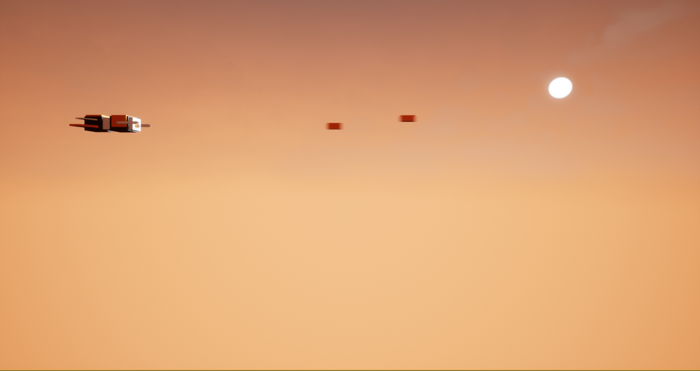

# StarFighter

Named after a Star Wars battleship, StarFighter is a 2D side scroller that will bring back nostalgic moments - with a twist!

This game was created both visually and programmatically, using blueprint classes in conjunction with C++ classes.

### Screenshots
This game is currently under development. Here is a teaser:

User's pawn in scene.

Single shot fired.

Multiple shots fired.

